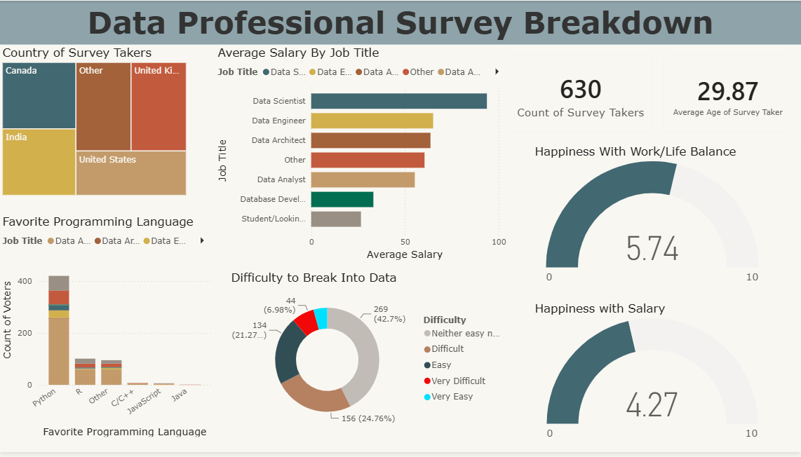

# 📊 Data Professional Survey Breakdown — Power BI
An interactive Power BI dashboard analysing survey 
responses from 630 data professionals worldwide.
## Dashboard Preview

## Key Insights
- 🐍 Python is the most favourite programming language
among data professionals
- 💰 Data Scientists earn the highest average salary
- 😊 Work/Life Balance rated 5.74/10 by data professionals
- 💸 Salary Happiness rated only 4.27/10
- 🌍 Majority of respondents from USA, India, 
UK and Canada
- 📈 42.7% found breaking into data "Neither Easy nor 
Difficult"
## Visuals Built
- Treemap — Country of Survey Takers
- Stacked Bar Chart — Average Salary by Job Title
- Donut Chart — Difficulty to Break into Data
- Stacked Bar Chart — Favourite Programming Language
- Gauge Charts — Happiness with Work/Life Balance & Salary
- KPI Cards — Total Survey Takers & Average Age
## Tools Used
- Power BI Desktop
- Power Query (Data Cleaning)
- DAX (Data Analysis Expressions)
- Data Modelling
